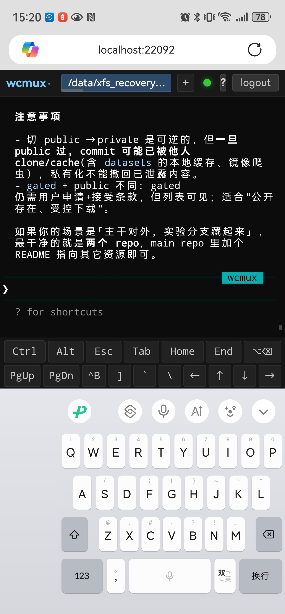
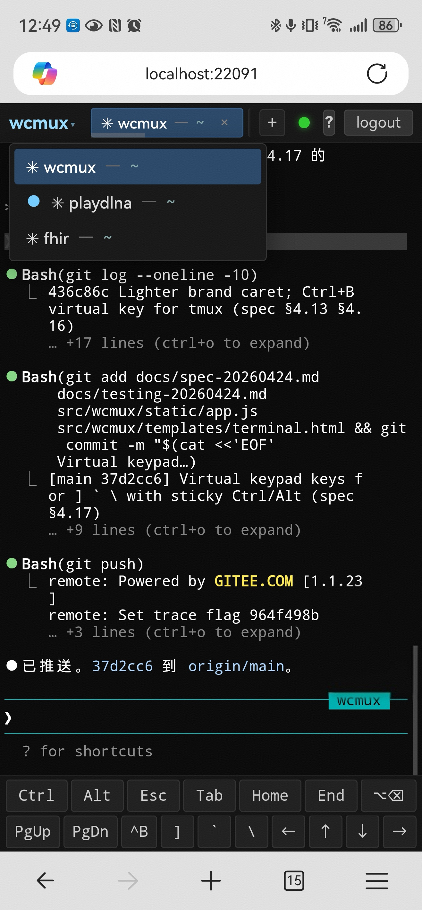
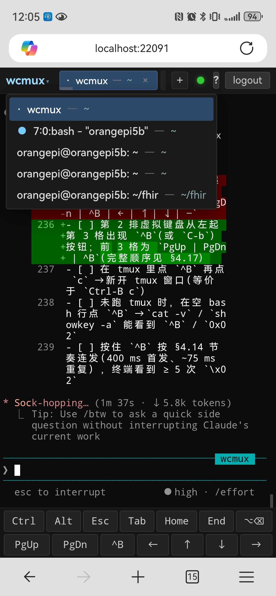

# wcmux

Web-based cmux — a FastAPI-driven, password-protected terminal multiplexer
that runs in your browser. Tabs, OSC-driven workspace tracking, persistent
reconnect, on-screen keypad for mobile, plus an integrated file
preview/search and public-share layer for the contents under `$HOME`
(and any extra mount points you whitelist).

Supported platforms: Linux, macOS, Windows 10 1809+. Python ≥ 3.10.

<p align="center">
  
  
  
</p>

## What's in the box

- **Multi-tab browser terminal** — xterm.js front-end over a Python PTY back-end,
  per-tab WebSocket with replay buffer + heartbeat keep-alive (§4.18) +
  exponential-backoff reconnect (§4.9). URLs in terminal output are tappable
  (web-links addon, §4.20). Scrollbar reserves a stable gutter so column
  count never jumps under Chromium when scrollback grows (§4.21).
- **Workspaces by cwd** — `?cwd=<abs path>` in the URL keys a workspace; tabs
  spawned with that param all start there and are listed under the brand
  drop-down. Closing the browser doesn't kill PTYs (§4.10 / §4.11).
- **Mobile-first keypad** — Sticky Ctrl/Alt that combines with the next
  character, hold-to-repeat arrows / PgUp / PgDn, plus the shell symbols
  (`]` `` ` `` `\`) Android/iOS soft keyboards bury two layers deep.
  Bottom-bar keypad floats above the on-screen keyboard via
  `visualViewport` (§4.12 – §4.17).
- **Remember this device** — toolbar drop-down toggle issues a long-lived
  signed token kept in `localStorage`; on cookie eviction the page
  silently exchanges it for a fresh session, no second login (§4.19).
- **File preview sub-router** — toolbar `+`-adjacent search box scans up to
  two directory levels under the configured roots, drops matching files
  into a list, opens them in a separate window with markdown / code /
  text / image / jsonl / drawio rendering (§4.22). Multi-root support
  via `WCMUX_PREVIEW_EXTRA_ROOTS` so USB / SD-card / NAS mounts are
  reachable too.
- **Public sharing** — preview pages have a 🔗 button that mints a
  `/share/<YYYY-MM-DD>/<slug>-<id12>` URL. Recipients view a self-rendered
  HTML (no JS, strict CSP, server-side pygments highlight, inline CSS).
  Markdown image references under the preview roots are auto-bundled.
  Default expiry 1 year, options 1d / 7d / 1mo / 3mo / 1y / 3y / never;
  revoke from the brand-menu "我的分享" page (§4.23).
- **Auth, lockout, and password hashing** — argon2id (`wcmux hash-password`),
  IP-based 5-fail / 15-min lockout shared across `/login`, `/api/auth/exchange`,
  and `/share/*` lookups.

## Install

```bash
# With uv (recommended — installs deps from pyproject.toml)
uv venv .venv --python 3.10
uv pip install -e .

# Or plain pip
python -m venv .venv && . .venv/bin/activate
pip install -e .
```

Runtime deps include `fastapi`, `uvicorn[standard]`, `itsdangerous`,
`argon2-cffi`, `bcrypt`, `markdown`, `pygments`, `ptyprocess` (Unix) /
`pywinpty` (Windows).

## Run

```bash
wcmux --password <your-password>
# or
WCMUX_PASSWORD=<pw> python -m wcmux
```

Browse to `http://<host>:8022/` and sign in.

## Configuration

All options also read from env vars. CLI args win over env vars.

| CLI | env | default |
|---|---|---|
| `--port` | `WCMUX_PORT` | `8022` |
| `--host` | `WCMUX_HOST` | `0.0.0.0` |
| `--base-url` | `WCMUX_BASE_URL` | `""` (no prefix) |
| `--password` | `WCMUX_PASSWORD` | **required** (or `WCMUX_PASSWORD_HASH`) |
| `--password-hash` | `WCMUX_PASSWORD_HASH` | preferred over plaintext for production |
| `--shell` | `WCMUX_SHELL` | `$SHELL` / `/bin/bash` (Unix), `%COMSPEC%` / `powershell.exe` (Win) |
| `--secret-key` | `WCMUX_SECRET_KEY` | random (warns; sessions / device tokens invalidated on restart) |
| `--trust-proxy` | `WCMUX_TRUST_PROXY=1` | off |
| — | `WCMUX_PREVIEW_ROOT` | `$HOME` (primary preview root, anchors relative paths) |
| — | `WCMUX_PREVIEW_EXTRA_ROOTS` | `""` (colon-separated extra roots, e.g. `/media/orangepi`) |
| — | `WCMUX_DEVICES_FILE` | `~/.local/share/wcmux/devices.json` |
| — | `WCMUX_SHARES_FILE` | `~/.local/share/wcmux/shares.json` |

Run `wcmux --help` for the authoritative CLI list.

Generate a password hash for production:

```bash
wcmux hash-password
# paste the resulting argon2id hash into wcmux.env as WCMUX_PASSWORD_HASH
```

## Hotkeys

| Keys | Action |
|---|---|
| `Ctrl+Alt+T` | New tab |
| `Ctrl+Alt+W` | Close current tab |
| `Ctrl+Alt+←` / `Ctrl+Alt+→` | Prev / next tab (cyclic) |
| `Ctrl+Alt+1` … `Ctrl+Alt+9` | Jump to tab by index |
| Tap `Ctrl` / `Alt` on bottom keypad | Sticky modifier — applies to next character |

## Endpoints

All routes live under `<base_url>` (default empty).

| Method | Path | Auth | Purpose |
|---|---|---|---|
| GET | `/` | session | Terminal page (the wcmux SPA) |
| GET | `/healthz` | none | Liveness probe |
| GET / POST | `/login` | none | Login form |
| POST | `/logout` | session | Clears the session cookie |
| GET / POST | `/api/tabs` | session | List / create tabs |
| DELETE / PATCH | `/api/tabs/{id}` | session | Close / rename |
| WS | `/ws/{tab_id}` | session | Per-tab terminal stream |
| POST | `/api/auth/issue-device-token` | session | Mint a long-lived device token |
| POST | `/api/auth/exchange` | none | Swap a device token for a session |
| GET / DELETE | `/api/auth/devices[/{id}]` | session | List / revoke devices |
| GET | `/api/preview/list` | session | Directory listing under preview roots |
| GET | `/api/preview/file` | session | Render-payload for one file |
| GET | `/api/preview/search` | session | Filename + dir-name substring search, depth ≤ 2 |
| POST | `/api/preview/save` | session | Save (drawio only, MVP) |
| GET | `/raw/preview` | session | Raw bytes of a previewable file |
| GET | `/static/preview/{index,preview,shares}.html` | session | Preview front-end |
| POST | `/api/share` | session | Create a public share for a previewable file |
| GET | `/api/share` | session | List shares |
| DELETE | `/api/share/{id}` | session | Revoke |
| GET | `/share/{date}/{slug}-{id12}` | **public** | Render the shared file (strict CSP) |
| GET | `/share/{date}/{slug}-{id12}/a` | **public** | Bundled markdown image asset |
| GET | `/share/{date}/{slug}-{id12}/raw` | **public** | Raw source for image-typed shares |

## Reverse proxy (Nginx)

Mount under a subpath like `/wcmux/`:

```nginx
location /wcmux/ {
    proxy_pass         http://127.0.0.1:8022/;
    proxy_http_version 1.1;
    proxy_set_header   Upgrade $http_upgrade;
    proxy_set_header   Connection "upgrade";
    proxy_set_header   Host $host;
    proxy_set_header   X-Forwarded-Proto $scheme;
    proxy_set_header   X-Forwarded-Host $host;
    proxy_read_timeout 3600s;
}
```

Start wcmux with the matching prefix:

```bash
wcmux --password ... --base-url /wcmux --trust-proxy
```

The preview front-end uses relative URLs throughout, so it works under any
prefix transparently.

## Run as a user systemd service

```ini
# ~/.config/systemd/user/wcmux.service
[Unit]
Description=wcmux — web cmux (user service)
After=network-online.target

[Service]
Type=simple
EnvironmentFile=%h/.config/wcmux.env
ExecStart=/bin/sh -c 'exec %h/.local/share/wcmux-venv/bin/wcmux --secret-key "$(cat %h/.config/wcmux.secret)"'
Restart=on-failure
RestartSec=3

[Install]
WantedBy=default.target
```

`~/.config/wcmux.env` typical contents:

```bash
WCMUX_PORT=22091
WCMUX_HOST=0.0.0.0
WCMUX_PASSWORD_HASH='$argon2id$v=19$m=65536,t=3,p=4$...$...'
# Optional: also expose external mounts to preview/share/search
WCMUX_PREVIEW_EXTRA_ROOTS=/media/orangepi:/mnt/nas
```

```bash
systemctl --user daemon-reload
systemctl --user enable --now wcmux.service
journalctl --user -u wcmux.service -f
```

(For a system-wide service run as another user, drop `%h` for absolute
paths and put the unit under `/etc/systemd/system/`.)

## Spec, testing, and implementation plan

Under `docs/`:

- `spec-YYYYMMDD.md` — requirements
- `testing-YYYYMMDD.md` — verification checklist
- `plan-YYYYMMDD.md` — implementation plan

The latest dated pair is the source of truth; older files are kept for
history (do not edit).

## Tests

Integration tests live in `tests/`. Each milestone has a dedicated script.
`tests/runserver.sh` starts a fresh server per script so state (e.g. login
lockouts, device-token registry, share registry) doesn't bleed across tests.

```bash
tests/runserver.sh tests/test_m1_auth.py tests/test_m2_single_tab.py \
                   tests/test_m3_multitab.py tests/test_m4_cwd.py \
                   tests/test_m5_baseurl.py tests/test_m6_exit_autoclose.py \
                   tests/test_m8_workspace.py tests/test_m9_osc_live.py \
                   tests/test_m10_stale_session.py \
                   tests/test_m11_device_token.py \
                   tests/test_m12_preview.py \
                   tests/test_m13_share.py
.venv/bin/python tests/test_m4_shorten.py
.venv/bin/python tests/test_m9_osc_unit.py
```

## License

MIT.
